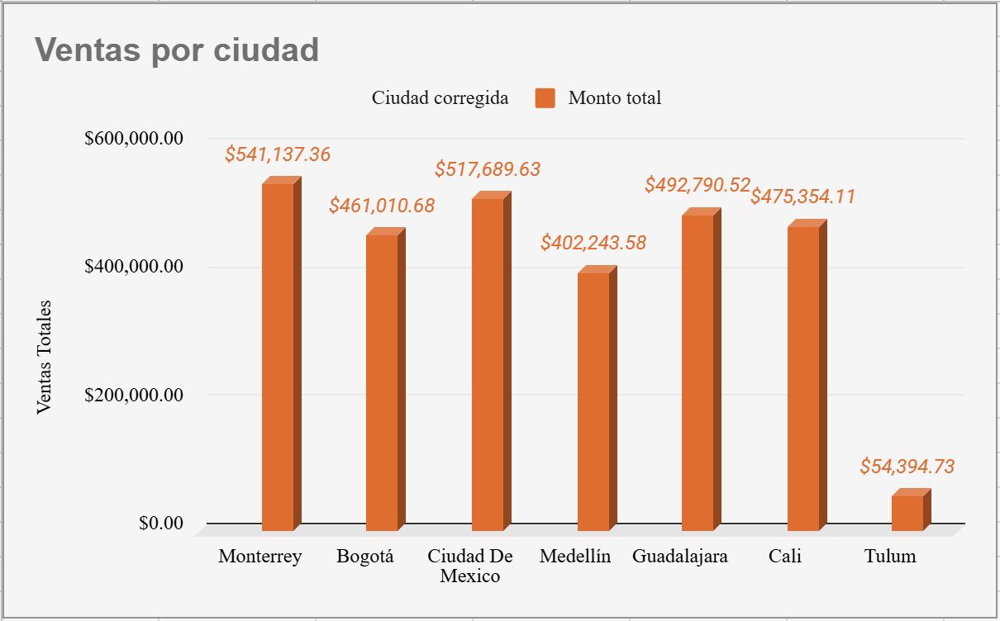
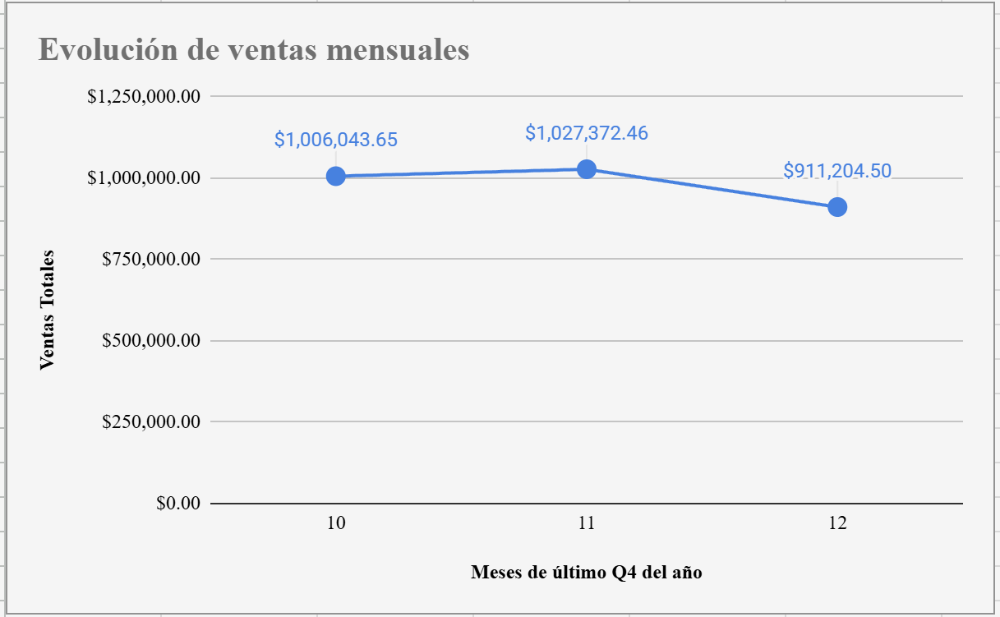

## 📂 Project Files

**Main project workbook**

➡️ **sales_data_cleaning_analysis.xlsx**

This workbook contains:
- Raw and cleaned data
- Data cleaning process
- Pivot tables
- Dashboard
- Executive summary
- QA validation

Click the Excel file in the repository above to preview or download it.

# Sales Data Cleaning & Business Analysis

Data cleaning and exploratory business analysis project completed as part of the TripleTen Data Analytics Bootcamp.

## Business Problem

VentaExpress, an online technology retailer operating in Mexico and Colombia, needed to transform raw sales data from Q4 2024 into reliable business information for decision-making.

The dataset contained duplicate records, inconsistent formatting, missing values, and unstructured product information that required cleaning before analysis.

---

## Project Objectives

- Clean and standardize raw sales data.
- Handle missing values and duplicate records.
- Prepare the dataset for business analysis.
- Calculate key business metrics.
- Create visualizations to identify sales trends.
- Deliver an executive summary with business recommendations.

---

## Tools Used

- Microsoft Excel
- Data Cleaning
- Business Analysis
- Data Visualization

---

## Key Results

- Removed duplicate records and standardized inconsistent city names.
- Recovered missing values using business logic and calculations.
- Identified the highest-performing city during Q4.
- Analyzed monthly sales trends.
- Produced an executive report with actionable business insights.

---

## Project Visualizations

### Sales by City

### Monthly Sales Trend

---

## What I Learned

This project reinforced the importance of preserving raw data, documenting every cleaning step, validating data quality before analysis, and communicating business insights through clear visualizations.

It also strengthened my analytical thinking by transforming raw business data into actionable information.

---

Part of my Data Analytics portfolio.
